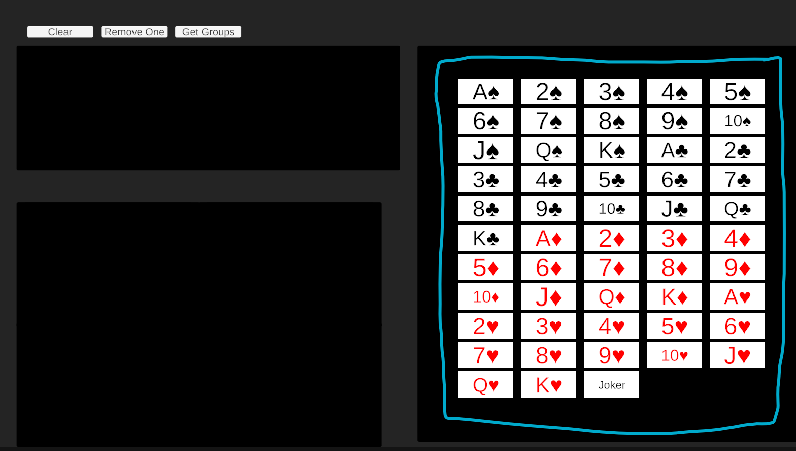
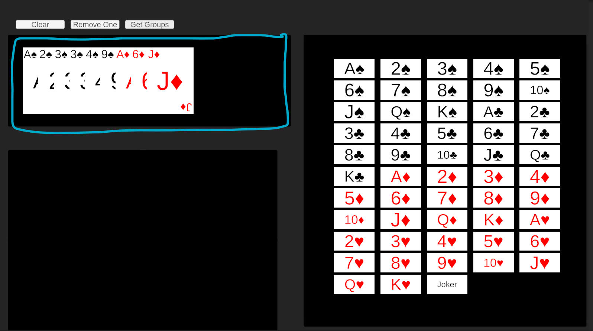
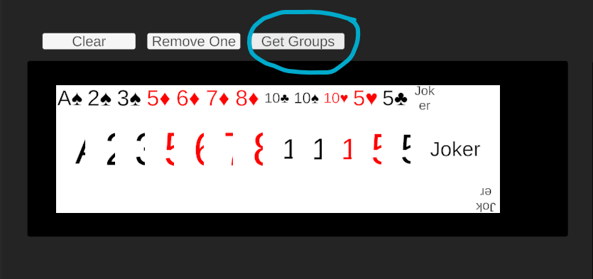
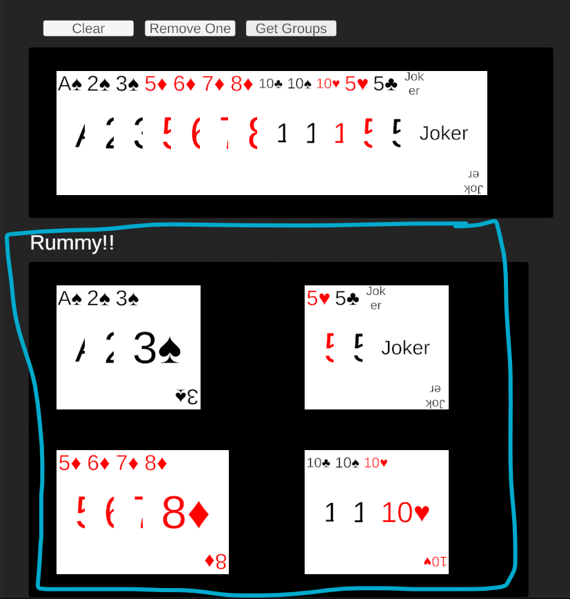

# Rummy-Verification

## Testing scene

you can find the testing scene in Assets > Scenes > TestScene. Play the test scene and you would
find a screen like this.

Use the buttons on the right to use add cards to your hand

When you select cards your cards would be displayed here

When you have selected 13 cards you can press the Get Groups button, to verify your hand

If you satisfy the conditions for a rummy you get break down of the sequences and sets you have made
otherwise you get a message saying win condition not satisfied

